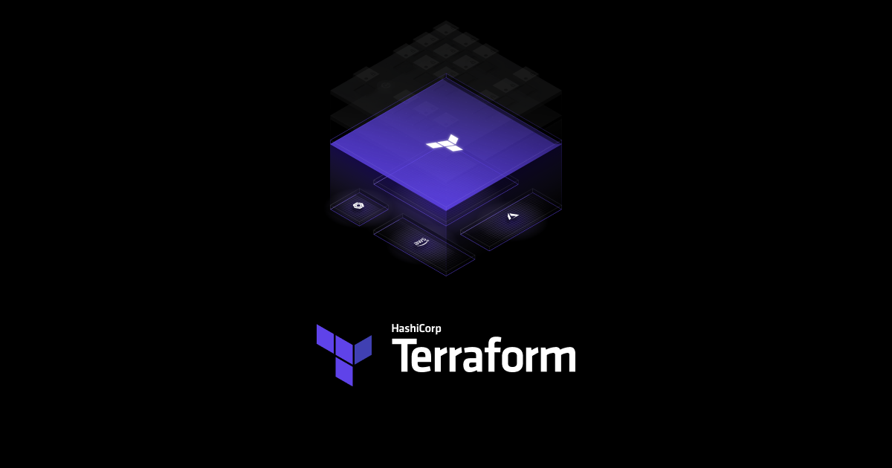

## Bootstrap a Docker Development Environment into a Linux Machine using Terraform.

---

#### What is Terraform?

Terraform is an open-source infrastructure as a code (IAC) tool that allows to create, manage & deploy the production-ready environment. Terraform codifies cloud APIs into declarative configuration files. Terraform can manage both existing service providers and custom in-house solutions.



#### What is Docker?

A container is a standard unit of software that packages up code and all its dependencies so the application runs quickly and reliably from one computing environment to another.


### Prerequisites:

-   Terraform
-   AWS account
-   AWS Access & Secret Key

**Step 1:  Declare the required providers, region and profile**
- Create a `provider.tf` file using this code below

```hcl
terraform {
	required_providers {
		aws = {
			source = "hashicorp/aws"
		}
	}
}
provider "aws" {
	region = "us-east-1"
	profile = "vscode"
}
```

**Step 2: Create a VPC with subnets, internet gateways, route tables and security groups**
- Create `main.tf` file 
- For this project I will create a private VPC with an ingress traffic only coming in from your personal IP address

```hcl
resource "aws_vpc" "brc_vpc" {
	cidr_block = "10.123.0.0/16"
	enable_dns_hostnames = true
	enable_dns_support = true

tags = {
	Name = "dev"
	}
}

resource "aws_subnet" "brc_public_subnet" {
	vpc_id = aws_vpc.brc_vpc.id
	cidr_block = "10.123.1.0/24"
	map_public_ip_on_launch = true
	availability_zone = "us-east-1a"

tags = {
	Name = "dev-public"
	}
}

resource "aws_internet_gateway" "brc_internet_gateway" {
	vpc_id = aws_vpc.brc_vpc.id

tags = {
	Name = "dev-igw"
	}
}

resource "aws_route_table" "brc_public_rt" {
	vpc_id = aws_vpc.brc_vpc.id

tags = {
	Name = "dev-public-rt"
	}
}

resource "aws_route" "default_route" {
	route_table_id = aws_route_table.brc_public_rt.id
	destination_cidr_block = "0.0.0.0/0"
	gateway_id = aws_internet_gateway.brc_internet_gateway.id
}

resource "aws_route_table_association" "brc_public_assoc" {
	subnet_id = aws_subnet.brc_public_subnet.id
	route_table_id = aws_route_table.brc_public_rt.id
}

resource "aws_security_group" "brc_sg" {
	name = "dev-sg"
	description = "dev security group"
	vpc_id = aws_vpc.brc_vpc.id

ingress {
	from_port = 0
	to_port = 0
	protocol = "-1"
	cidr_blocks = ["76.184.44.32/32"]
}

egress {
	from_port = 0
	to_port = 0
	protocol = "-1"
	cidr_blocks = ["0.0.0.0/0"]
	}
}
```

- Generate a public key with the command `ssh-keygen -t rsa` in the terminal.
- Create a key pair resource and link it to the ssh key pair directory

```hcl
resource "aws_key_pair" "brc_auth" {
	key_name = "brckey"
	public_key = file("~/.ssh/brckey.pub")
}
```

- Create an EC2 instance with instance type
- Attach the ami id
- Attach the key pair id
- Attach subnet id
- Attach Docker Bootstrap user data
- Provision the instance with linux/windows configuration
- Configure an interpreter within the instance

```hcl
resource "aws_instance" "dev_node" {
	instance_type = "t2.micro"
	ami = data.aws_ami.server_ami.id
	key_name = aws_key_pair.brc_auth.id
	vpc_security_group_ids = [aws_security_group.brc_sg.id]
	subnet_id = aws_subnet.brc_public_subnet.id
	user_data = file("userdata.tpl")

	root_block_device {
		volume_size = 10
	}

	tags = {
		Name = "dev-node"
}

	provisioner "local-exec" {
		command = templatefile("${var.host_os}-ssh-config.tpl", {
			hostname = self.public_ip,
			user = "ubuntu",
			identityfile = "~/.ssh/brckey"
	})

	interpreter = var.host_os == "linux" ? ["bash", "-c"] : ["Powershell", "Command"]
	}
}
```

**Step 3: Create Datasource**
- Create `datasources.tf` file 
- Attach the EC2 owner id 
- Attach AMI name

```hcl
data "aws_ami" "server_ami" {
	most_recent = true
	owners = ["099720109477"]

	filter {
		name = "name"
		values = ["ubuntu/images/hvm-ssd/ubuntu-jammy-22.04-amd64-server-*"]
	}
}
```

**Step 4: Create variables**
- Create `variable.tf` file for the host os

```hcl
variable "host_os" {
	type = string
	default = "linux"
}
```

**Step 5: Docker Bootstrap**
- create `userdata.tpl` template file to bootstap Docker to the instance

```
#!/bin/bash
sudo apt-get update -y &&
sudo apt-get install -y \
apt-transport-https \
ca-certificates \
curl \
gnupg-agent \
software-properties-common &&
curl -fsSL https://download.docker.com/linux/ubuntu/gpg | sudo apt-key add - &&
sudo add-apt-repository "deb [arch=amd64] https://download.docker.com/linux/ubuntu $(lsb_release -cs) stable" &&
sudo apt-get update -y &&
sudo sudo apt-get install docker-ce docker-ce-cli containerd.io -y &&
sudo usermod -aG docker ubuntu
```

**Step 6: Output the IP address**
- Create `output.tf` file to output the ip address

```hcl
output "dev_ip" {
	value = aws_instance.dev_node.public_ip
}
```

**Step 7: Create config file**
- Create a `linux-ssh-config.tpl` config file to attach to the provisioner on the instance

```
cat << EOF >> ~/.ssh/config

Host ${hostname}
    HostName ${hostname}
    User ${user}
    IdentityFile ${identityfile}
EOF
```